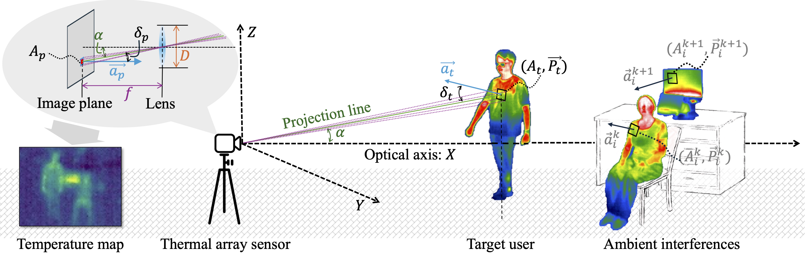
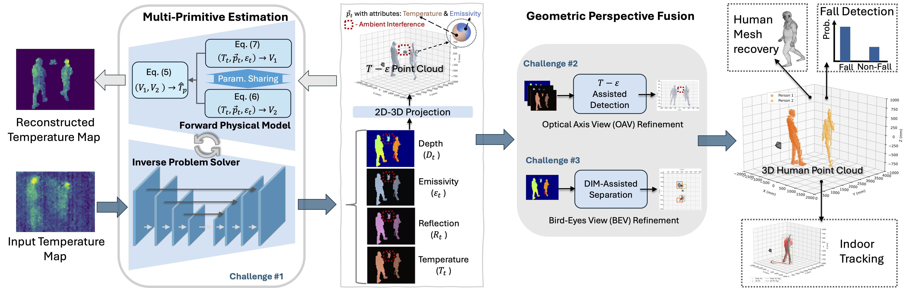

# TAP3D

This is the repository of **TAP3D**: From heat to 3D point cloud in human sensing.

**TAP3D** is the first system to reconstruct 3D human Point clouds from body heat signatures with a low-cost thermal array sensor.

We construct the thermal physical model that describes the relationship between the body heat signatures and the 3D point cloud of the human body.

<div align="center">
  
</div>

We, then, propose the physics-informed **TAP3D** model to estimate the 3D point cloud of the human body from the body heat signatures.

<div align="center">
  
</div>

## Environment and Structures
```bash
conda create -n tap3d python=3.10
conda activate tap3d
pip install -r requirements.txt
```

The folder structure is as follows:
```bash
├── AnnotatedData: The annotated dataset.
├── data_configs: The data configuration files.
├── exp_configs: The experiment configuration files.
├── images: The images used in this repository.
├── logs: The log files.
├── runs: The run files.
├── utils: The utility files.
├── main.py: The main file.
├── Metrics.py: The metrics file.
├── Losses.py: The losses file.
├── Models.py: The models file.
├── ThermalDataset.py: The dataset file.
├── utils.py: The utils file.
├── output_check_visualize.py: The file to check the output and visualize the results.
├── output_metric_calc.py: The file to calculate the metrics of the output.
├── requirements.txt: The requirements file.
└── README.md: The readme file.
```

## Dataset and weights

The dataset and weights can be downloaded from here: [TAP3D_dataset and weights](https://1drv.ms/f/c/bcc85cc8aeae2510/Egeueqc-OdJLtx5Cm-rsgXYBmXvJ3EsxVY73lx6-mF3jaQ?e=OIdNsN)


## Training and testing (Optional)

<font color="red">
The trained model weights and testing results are contained in the weights/ and logs/ folders. Hence, you can skip the training process and directly use the trained model weights and testing results.
Moreover, you can directly move the to the results analysis and visualization section to check the main results that are presented in the paper.
</font>


### Start training and testing
Run the main.py to train and test the model.
```python
python main.py --exp_config_file 'model3_m08' --cuda_index 0 --mode 0 --pretrained_model 'pretrained_model_weights' --vis_enable 1
```
* exp_config_file: the name of the experiment config file.
* cuda_index: the index of the cuda device.
* mode: 0: train + test, 1: test only, 2: finetune/resume training + test, 3: check the pipeline
* pretrained_model: the file path of the pretrained model weights.
* vis_enable: 1: enable visualization by directly output results to video file.

### Log files
* the running process is recorded with tensorboard saved in the runs/ folder.
* the output of the model is saved in the logs/ folder.
* the model weights is saved in the weights/ folder.

### Metrics calculation
  * We can calculate the metrics of the output with the output_metric_calc.py script.
  ```python
  python output_metric_calc.py --log_folder_path logs/m08/model3_m08_thermo_pt_0819203728
  ```

## Results analysis and visualization
Run the Fig_overall.ipynb to analyze the results and visualize the results.

## Other Notes
This project uses PyTorch3D for 3D operations. To install PyTorch3D, use the following command:
```bash
pip install --extra-index-url https://miropsota.github.io/torch_packages_builder pytorch3d==0.7.8+pt2.5.1cu121
# this command is for pytorch 2.5.1 and cuda 12.1
* for the three dimension point cloud: index (0,1,2) is x, y, z (z is the depth), the unit is mm.
```

## Citation
Coming soon.
