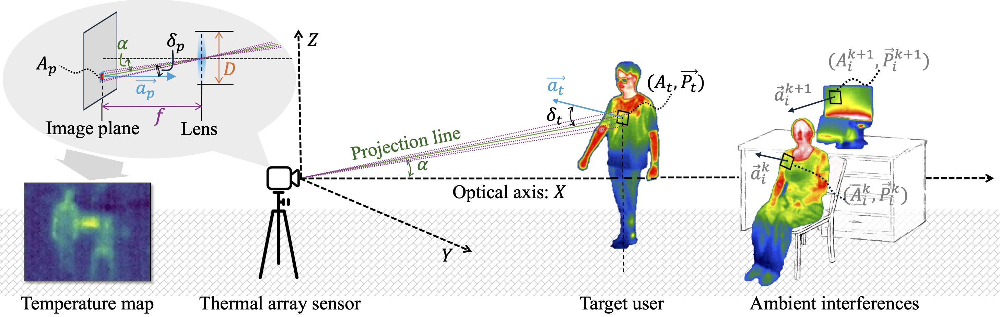
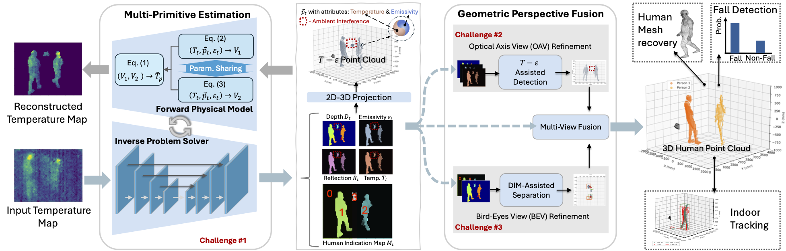

# TAP3D: Thermal-Assisted 3D Human Point Clouds

Official code release for **TAP3D: Thermal-Assisted 3D Human Point Clouds**.

This repository contains training and evaluation code for reconstructing 3D human point clouds from low-resolution thermal array data.


**TAP3D** is the first system to reconstruct 3D human Point clouds from body heat signatures with a low-cost thermal array sensor.

We construct the thermal physical model that describes the relationship between the body heat signatures and the 3D point cloud of the human body.

<div align="center">
  
</div>

We, then, propose the physics-informed **TAP3D** model to estimate the 3D point cloud of the human body from the body heat signatures.

<div align="center">
  
</div>

🎥 Demo video: [Thermal-Assisted 3D Human Point Clouds](https://youtu.be/dZlmARmof9M)

## Folder Structure

```
.
├── AnnotatedData/              # Annotated dataset (download separately)
├── weights/                    # Model checkpoints (download separately)
├── logs/                       # Experiment logs and outputs (download separately)
├── TAP3D_compare2others/       # Cross-system comparison data (download separately)
├── data_configs/               # Dataset split and path configs
├── exp_configs/                # Experiment configs (model, hyperparameters)
├── Models/                     # Model definitions (ThermoPT, UNet, NeWCRF, RGB2point, …)
├── main.py                     # Training and testing entry point
├── ThermalDataset.py           # Dataset loader
├── download_extract.sh         # Downloading logs, weights and AnnotatedData (dataset) from HF, and unzip
├── environment_setup.sh        # Setting up Python environment by downloading the libraries
├── Losses.py                   # Loss functions
├── Metrics.py                  # Evaluation metrics
├── utils.py                    # Training / inference utilities
├── output_metric_calc.py       # Aggregate metrics from log folders
├── output_check_visualize.py   # Visualize predictions as video
├── batch_output_metric_calc.py # Batch wrapper for output_metric_calc.py
├── Reproduce_results.ipynb     # Reproduce main paper results
└── requirements.txt            # Python dependencies
```

## Setup

### Environment

We recommend Python 3.9 with CUDA. Install core dependencies:

```bash
  # Optional: create a new environment
  conda create -n tap3d python=3.9
  conda activate tap3d
  # command for install all dependencies:
  bash environment_setup.sh
```
**Note for macOS Users**: Installing the pytorch3d library may fail on macOS. However, this error can be ignored if you only intend to evaluate Level 1. For Levels 2 and 3, we strongly recommend using a Linux environment equipped with a GPU.

### Coordinate system

3D point cloud coordinates use `(x, y, z)` with **z as depth** (distance from the sensor). All units are in **millimeters (mm)**.

### Artifact downloads

Large artifacts are hosted outside this repository. Download only what your target Level requires (see the table below), then extract each archive into the repository root.

| Artifact | Description | Needed for | Download | Size |
|----------|-------------|------------|----------|----------|
| `logs/` | Precomputed metric pickles | Level 1 | `https://huggingface.co/datasets/TAP3DNow/TAP3D/resolve/main/logs.zip?download=true` | 46 MB |
| `TAP3D_compare2others/` | Depth comparison vs. Radar / TADAR | Level 1 (Figure 10) | `https://huggingface.co/datasets/TAP3DNow/TAP3D/resolve/main/TAP3D_compare2others.zip?download=true` | 62.7 KB |
| `weights/` | Pretrained checkpoints | Level 2 (and SSL finetune in Level 3) | `https://huggingface.co/datasets/TAP3DNow/TAP3D/resolve/main/weights.zip?download=true` | 1.5 GB |
| `AnnotatedData/` | Annotated recordings and labels | Level 2 and Level 3 | `https://huggingface.co/datasets/TAP3DNow/TAP3D/tree/main/AnnotatedData` |   2.78 GB |


```bash
  bash download_extract.sh
```
By default, the script downloads all resources for Levels 1–3. To download specific files (e.g., only logs.zip and TAP3D com-
pare2others.zip for Level 1), please refer to the level-specific sections below and download them manually from our Hugging Face repository.

---

## Usage (shallow → deep)

The workflows below are ordered from lightest to heaviest. Start with **Level 1** if you only need to verify the paper results.


### Level 1 — Reproduce results (no GPU inference required)

**Goal:** Regenerate the main paper tables and figures from precomputed outputs.

**Download:** `logs/` and `TAP3D_compare2others/`

**Steps:**

1. Clone this repository and complete [Setup](#setup).
2. Download and extract `logs/` and `TAP3D_compare2others/` into the repo root.
3. Open [`Reproduce_results.ipynb`](Reproduce_results.ipynb) and run all cells.

The notebook reads the provided `final_metric.pickle` files and regenerates the paper tables and figures. No GPU inference or retraining is needed.

---

### Level 2 — Inference only (GPU recommended)

**Goal:** Re-run test-set inference from pretrained checkpoints and recompute metrics.

> **Note:** Level 2 writes new timestamped folders under `logs/`. If you already downloaded the Level 1 `logs/` archive, move or remove it first so the new runs are not mixed with the precomputed ones (especially if you use `batch_output_metric_calc.py` later in this level).

**Step 1: Download** `AnnotatedData/` and `weights/`

Download links are listed in [Artifact downloads](#artifact-downloads). Extract both archives into the repository root.


**Step 2: Inference** 

After each inference, the results for each test segment (these can be large files) are saved in a **new, timestamped subfolder** under `logs/m08/`.

Use the following commands to reproduce the experiments corresponding to the main figures and tables in the paper.

<details>
<summary>TAP3D + ablation checkpoints (Table 3, Figures 11–19, 23–25)</summary>

```bash
# TAP3D (model3: reconstruction + OAV + BEV)
python main.py --exp_config_file model3_m08 --mode 1 \
  --pretrained_model weights/m08/model3_m08_thermo_pt_0819203728.pth
# precomputed: logs/m08/model3_m08_thermo_pt_1223164517_test

# Baselines (Table 3)
python main.py --exp_config_file RGB2point_m08 --mode 1 \
  --pretrained_model weights/m08/RGB2point_m08_rgb2point_1224214917.pth
# precomputed: logs/m08/RGB2point_m08_rgb2point_1224214917

python main.py --exp_config_file NeWCRF_m08 --mode 1 \
  --pretrained_model weights/m08/NeWCRF_m08_newcrf_depth_1225230530.pth
# precomputed: logs/m08/NeWCRF_m08_newcrf_depth_1225230530

# model0: backbone only
python main.py --exp_config_file model0_m08 --mode 1 \
  --pretrained_model weights/m08/model0_m08_thermo_pt_0819092207.pth
# precomputed: logs/m08/model0_m08_thermo_pt_1223162912_test

# model1: + reconstruction (no OAV / BEV)
python main.py --exp_config_file model1_m08 --mode 1 \
  --pretrained_model weights/m08/model1_m08_thermo_pt_0819203603.pth
# precomputed: logs/m08/model1_m08_thermo_pt_1223163549_test

# model2: + reconstruction + OAV
python main.py --exp_config_file model2_m08 --mode 1 \
  --pretrained_model weights/m08/model2_m08_thermo_pt_0819203650.pth
# precomputed: logs/m08/model2_m08_thermo_pt_1223164117_test

# model4: multi-primitive estimation (Figure 25)
python main.py --exp_config_file model4_m08 --mode 1 \
  --pretrained_model weights/m08/model4_m08_thermo_pt_1222210636.pth
# precomputed: logs/m08/model4_m08_thermo_pt_1222210636
```
</details>

<details>
<summary>Temperature perturbation (Figure 20)</summary>

```bash
python main.py --exp_config_file model3_m08 --mode 1 \
  --pretrained_model weights/m08/model3_m08_thermo_pt_0819203728.pth \
  --pertureb_temperature 1
python main.py --exp_config_file model3_m08 --mode 1 \
  --pretrained_model weights/m08/model3_m08_thermo_pt_0819203728.pth \
  --pertureb_temperature 2
python main.py --exp_config_file model3_m08 --mode 1 \
  --pretrained_model weights/m08/model3_m08_thermo_pt_0819203728.pth \
  --pertureb_temperature 3
python main.py --exp_config_file model3_m08 --mode 1 \
  --pretrained_model weights/m08/model3_m08_thermo_pt_0819203728.pth \
  --pertureb_temperature 4
python main.py --exp_config_file model3_m08 --mode 1 \
  --pretrained_model weights/m08/model3_m08_thermo_pt_0819203728.pth \
  --pertureb_temperature -1
python main.py --exp_config_file model3_m08 --mode 1 \
  --pretrained_model weights/m08/model3_m08_thermo_pt_0819203728.pth \
  --pertureb_temperature -2
python main.py --exp_config_file model3_m08 --mode 1 \
  --pretrained_model weights/m08/model3_m08_thermo_pt_0819203728.pth \
  --pertureb_temperature -3
python main.py --exp_config_file model3_m08 --mode 1 \
  --pretrained_model weights/m08/model3_m08_thermo_pt_0819203728.pth \
  --pertureb_temperature -4
```

Precomputed logs: `logs/m08/model3_m08_thermo_pt_122611*_test_pertureb_{±1,±2,±3,±4}`.

</details>

<details>
<summary>Room-temperature robustness (Figure 21)</summary>

```bash
python main.py --exp_config_file TAP3D_m08_add_RT_exp --mode 1 \
  --pretrained_model weights/m08/model3_m08_thermo_pt_0819203728.pth
# precomputed: logs/m08/TAP3D_m08_add_RT_exp_thermo_pt_0609235152_test
```
</details>

<details>
<summary>DIM parameter sensitivity (Figure 22)</summary>

Default DIM (`bin_size=20`, `depth_max=8000`, `sigma=0.5`):

```bash
python main.py --exp_config_file TAP3D_m08_add_DIM_Sensitivity --mode 1 \
  --pretrained_model weights/m08/model3_m08_thermo_pt_0819203728.pth \
  --DIM_sensitivity_evaluation 0
# precomputed: logs/m08/TAP3D_m08_add_DIM_Sensitivity_thermo_pt_0724123208_test
```

Sweep `bin_size` (J bins ≈ `8000 / bin_size`):

```bash
python main.py --exp_config_file TAP3D_m08_add_DIM_Sensitivity --mode 1 \
  --pretrained_model weights/m08/model3_m08_thermo_pt_0819203728.pth \
  --DIM_sensitivity_evaluation 1 --DIM_bin_size 14. --DIM_depth_max 8000. --DIM_sigma 0.5
python main.py --exp_config_file TAP3D_m08_add_DIM_Sensitivity --mode 1 \
  --pretrained_model weights/m08/model3_m08_thermo_pt_0819203728.pth \
  --DIM_sensitivity_evaluation 1 --DIM_bin_size 10. --DIM_depth_max 8000. --DIM_sigma 0.5
python main.py --exp_config_file TAP3D_m08_add_DIM_Sensitivity --mode 1 \
  --pretrained_model weights/m08/model3_m08_thermo_pt_0819203728.pth \
  --DIM_sensitivity_evaluation 1 --DIM_bin_size 40. --DIM_depth_max 8000. --DIM_sigma 0.5
python main.py --exp_config_file TAP3D_m08_add_DIM_Sensitivity --mode 1 \
  --pretrained_model weights/m08/model3_m08_thermo_pt_0819203728.pth \
  --DIM_sensitivity_evaluation 1 --DIM_bin_size 80. --DIM_depth_max 8000. --DIM_sigma 0.5
```

Sweep `sigma`:

```bash
python main.py --exp_config_file TAP3D_m08_add_DIM_Sensitivity --mode 1 \
  --pretrained_model weights/m08/model3_m08_thermo_pt_0819203728.pth \
  --DIM_sensitivity_evaluation 1 --DIM_bin_size 20. --DIM_depth_max 8000. --DIM_sigma 0.1
python main.py --exp_config_file TAP3D_m08_add_DIM_Sensitivity --mode 1 \
  --pretrained_model weights/m08/model3_m08_thermo_pt_0819203728.pth \
  --DIM_sensitivity_evaluation 1 --DIM_bin_size 20. --DIM_depth_max 8000. --DIM_sigma 0.05
python main.py --exp_config_file TAP3D_m08_add_DIM_Sensitivity --mode 1 \
  --pretrained_model weights/m08/model3_m08_thermo_pt_0819203728.pth \
  --DIM_sensitivity_evaluation 1 --DIM_bin_size 20. --DIM_depth_max 8000. --DIM_sigma 1.0
python main.py --exp_config_file TAP3D_m08_add_DIM_Sensitivity --mode 1 \
  --pretrained_model weights/m08/model3_m08_thermo_pt_0819203728.pth \
  --DIM_sensitivity_evaluation 1 --DIM_bin_size 20. --DIM_depth_max 8000. --DIM_sigma 10.0
```
</details>

<details>
<summary>Self-supervised models (Figure 26)</summary>

Re-run test-set inference with the released checkpoints (`--mode 1`).  
Do **not** use the SSL-pretrain-only checkpoint (`TAP3D_m08_SSL_human_*.pth`) — it is reconstruction-only and does not produce the paper’s point-cloud metrics.

`--trainset_portion` is **not** needed for inference: each checkpoint was already trained on the corresponding labeled fraction (10% / 20% / 40%). The full test set is always evaluated.

**Without SSL** (supervised only):

```bash
python main.py --exp_config_file TAP3D_m08_SL --mode 1 \
  --pretrained_model weights/m08/TAP3D_m08_SL_thermo_pt_1223230750_trainset_0_1.pth
# precomputed: logs/m08/TAP3D_m08_SL_thermo_pt_1223230750_trainset_0_1

python main.py --exp_config_file TAP3D_m08_SL --mode 1 \
  --pretrained_model weights/m08/TAP3D_m08_SL_thermo_pt_1223234527_trainset_0_2.pth
# precomputed: logs/m08/TAP3D_m08_SL_thermo_pt_1223234527_trainset_0_2

python main.py --exp_config_file TAP3D_m08_SL --mode 1 \
  --pretrained_model weights/m08/TAP3D_m08_SL_thermo_pt_1224004732_trainset_0_4.pth
# precomputed: logs/m08/TAP3D_m08_SL_thermo_pt_1224004732_trainset_0_4
```

**With human SSL pretraining** (then finetuned):

```bash
python main.py --exp_config_file TAP3D_m08_SSL_SL --mode 1 \
  --pretrained_model weights/m08/TAP3D_m08_SSL_SL_thermo_pt_1224144225_finetune_trainset_0_1.pth
# precomputed: logs/m08/TAP3D_m08_SSL_SL_thermo_pt_1224144225_finetune_trainset_0_1

python main.py --exp_config_file TAP3D_m08_SSL_SL --mode 1 \
  --pretrained_model weights/m08/TAP3D_m08_SSL_SL_thermo_pt_1224150406_finetune_trainset_0_2.pth
# precomputed: logs/m08/TAP3D_m08_SSL_SL_thermo_pt_1224150406_finetune_trainset_0_2

python main.py --exp_config_file TAP3D_m08_SSL_SL --mode 1 \
  --pretrained_model weights/m08/TAP3D_m08_SSL_SL_thermo_pt_1228191624_finetune_trainset_0_4.pth
# precomputed: logs/m08/TAP3D_m08_SSL_SL_thermo_pt_1228191624_finetune_trainset_0_4
```
To **train** these models from scratch (or re-finetune from `SSL_human`), see Level 3.

</details>

| Argument | Description |
|----------|-------------|
| `--exp_config_file` | Experiment config name (without `.yaml`) |
| `--cuda_index` | GPU index |
| `--mode` | `1`: test only |
| `--pretrained_model` | Path to checkpoint |
| `--vis_enable` | `1`: write visualization videos during testing |
| `--pertureb_temperature` | Add a constant temperature offset at test time |
| `--DIM_sensitivity_evaluation` | `1`: override DIM hyperparameters |

---

**Step 3: Calculate metrics**

After inference, aggregate metrics into `final_metric.pickle` files.

Batch (all run folders under `logs/m08/`):

```bash
python batch_output_metric_calc.py
```

Single run:

```bash
python output_metric_calc.py --log_folder_path logs/m08/<your_run_folder>
```

You can then compare your `final_metric.pickle` files against the precomputed ones used in [`Reproduce_results.ipynb`](Reproduce_results.ipynb), or replace the notebook paths with your new run folders and re-run the cells.

<details>
<summary>Pickle paths used in <code>Reproduce_results.ipynb</code></summary>

| Paper ref. | Path |
|------------|------|
| Table 2 (pilot) | `logs/m08/unet_m08_pilot_unet_like_0626101104/final_metric.pickle` |
| Table 3 (TAP3D) | `logs/m08/model3_m08_thermo_pt_1223164517_test/final_metric.pickle` |
| Table 3 (RGB2Point) | `logs/m08/RGB2point_m08_rgb2point_1224214917/final_metric.pickle` |
| Table 3 (NeWCRF) | `logs/m08/NeWCRF_m08_newcrf_depth_1225230530/final_metric.pickle` |
| Figures 11–19, 23–25 | `model3` / `model0` / `model1` / `model2` / `model4` logs above |
| Figure 20 (±1…±4°C) | `logs/m08/model3_m08_thermo_pt_122611*_test_pertureb_{±1,±2,±3,±4}/final_metric.pickle` |
| Figure 21 | `logs/m08/TAP3D_m08_add_RT_exp_thermo_pt_0609235152_test/final_metric.pickle` |
| Figure 22 (DIM) | `logs/m08/TAP3D_m08_add_DIM_Sensitivity_thermo_pt_*/final_metric.pickle` |
| Figure 26 (w/o SSL) | `logs/m08/TAP3D_m08_SL_thermo_pt_*_trainset_0_{1,2,4}/final_metric.pickle` |
| Figure 26 (w/ SSL) | `logs/m08/TAP3D_m08_SSL_SL_thermo_pt_*_finetune_trainset_0_{1,2,4}/final_metric.pickle` |

</details>


### Level 3 — Train and test (GPU required)

**Goal:** Train from scratch (or pretrain + finetune) and evaluate on the test set.

> **Note:** Training writes new timestamped folders under `logs/` and checkpoints under `weights/`. Move or remove any previous Level 1/2 `logs/` if you want a clean directory.

**Step 1: Download** `AnnotatedData/`

Download links are listed in [Artifact downloads](#artifact-downloads). Extract into the repository root.

`weights/` is optional: only needed if you skip SSL pretraining and finetune from the released `TAP3D_m08_SSL_human_*.pth` checkpoint.

**Step 2: Train**

| `--mode` | Behavior |
|----------|----------|
| `0` | Train + test |
| `1` | Test only |
| `2` | Finetune / resume training + test |
| `3` | Pipeline check (quick sanity run) |

**Outputs:** `runs/` (TensorBoard), `logs/` (predictions), `weights/` (checkpoints).

<details>
<summary>Pilot study (Table 2)</summary>

```bash
python main.py --exp_config_file unet_m08_pilot --mode 0
# precomputed: logs/m08/unet_m08_pilot_unet_like_0626101104
```

Data splits: `data_configs/train_pilot.yaml`, `test_pilot.yaml`.

</details>

<details>
<summary>TAP3D and architecture ablations (Table 3, Figures 23–25)</summary>

```bash
# TAP3D (full model)
python main.py --exp_config_file model3_m08 --mode 0

# Ablations
python main.py --exp_config_file model0_m08 --mode 0   # backbone only
python main.py --exp_config_file model1_m08 --mode 0   # + reconstruction
python main.py --exp_config_file model2_m08 --mode 0   # + reconstruction + OAV
python main.py --exp_config_file model4_m08 --mode 0   # multi-primitive estimation (Figure 25)
# precomputed model4: logs/m08/model4_m08_thermo_pt_1222210636
```

Data splits: `data_configs/train.yaml`, `test.yaml`.

</details>

<details>
<summary>Baselines (Table 3)</summary>

```bash
python main.py --exp_config_file RGB2point_m08 --mode 0
# precomputed: logs/m08/RGB2point_m08_rgb2point_1224214917

python main.py --exp_config_file NeWCRF_m08 --mode 0
# precomputed: logs/m08/NeWCRF_m08_newcrf_depth_1225230530
```

Data splits: `data_configs/train.yaml`, `test.yaml`.

</details>

<details>
<summary>Self-supervised pretraining (Figure 26)</summary>

**1. Pretrain** on unlabeled thermal frames (human-masked reconstruction):

```bash
python main.py --exp_config_file TAP3D_m08_SSL_human --mode 0
# checkpoint: weights/m08/TAP3D_m08_SSL_human_thermo_pt_1223224156.pth
```

Data split: `data_configs/train_SSL.yaml`. SSL pretraining does not produce the paper’s point-cloud metrics.

**2. Supervised training without SSL** (10% / 20% / 40% of labeled data):

```bash
python main.py --exp_config_file TAP3D_m08_SL --mode 0 --trainset_portion 0.1
python main.py --exp_config_file TAP3D_m08_SL --mode 0 --trainset_portion 0.2
python main.py --exp_config_file TAP3D_m08_SL --mode 0 --trainset_portion 0.4
```

**3. Finetune the SSL checkpoint** on the same labeled fractions:

```bash
python main.py --exp_config_file TAP3D_m08_SSL_SL --mode 2 --trainset_portion 0.1 \
  --pretrained_model weights/m08/TAP3D_m08_SSL_human_thermo_pt_1223224156.pth
python main.py --exp_config_file TAP3D_m08_SSL_SL --mode 2 --trainset_portion 0.2 \
  --pretrained_model weights/m08/TAP3D_m08_SSL_human_thermo_pt_1223224156.pth
python main.py --exp_config_file TAP3D_m08_SSL_SL --mode 2 --trainset_portion 0.4 \
  --pretrained_model weights/m08/TAP3D_m08_SSL_human_thermo_pt_1223224156.pth
```

Data split: `data_configs/train_SSL_SL.yaml`. Precomputed logs used in the notebook:

- w/o SSL: `TAP3D_m08_SL_thermo_pt_1223230750_trainset_0_1`, `_1223234527_trainset_0_2`, `_1224004732_trainset_0_4`
- w/ human SSL: `TAP3D_m08_SSL_SL_thermo_pt_1224144225_finetune_trainset_0_1`, `_1224150406_finetune_trainset_0_2`, `_1228191624_finetune_trainset_0_4`

</details>

**Step 3: Calculate metrics**

Same as Level 2 — after training finishes (training already runs a test pass), aggregate metrics if needed:

```bash
python batch_output_metric_calc.py
# or
python output_metric_calc.py --log_folder_path logs/m08/<your_run_folder>
```

Then compare or replace the pickles in [`Reproduce_results.ipynb`](Reproduce_results.ipynb) (see Level 2 Step 3 for the path list).

---

## Citation

If you use this code, please cite our paper:

```bibtex
@article{tap3d2026,
  title   = {TAP3D: Thermal-Assisted 3D Human Point Clouds},
  author  = {TBD},
  journal = {TBD},
  year    = {2026}
}
```

## License

MIT License
